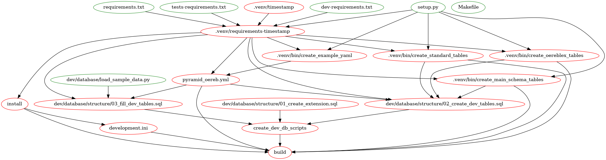
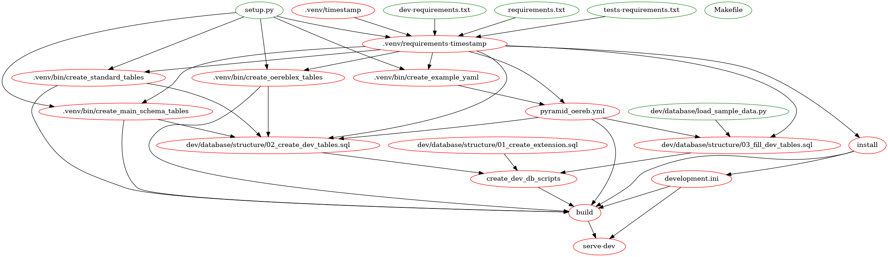
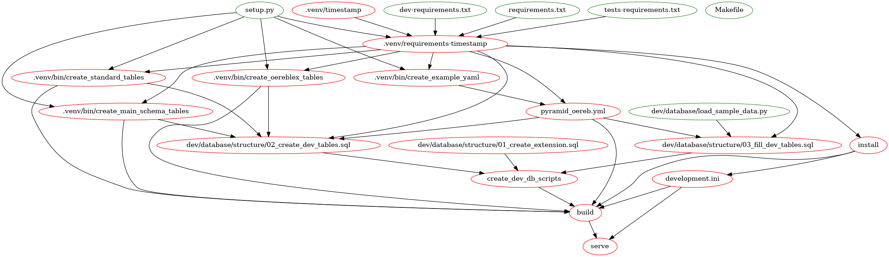
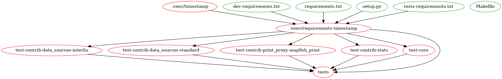
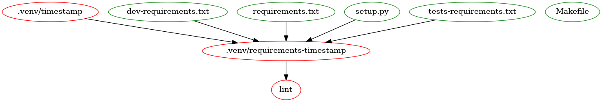
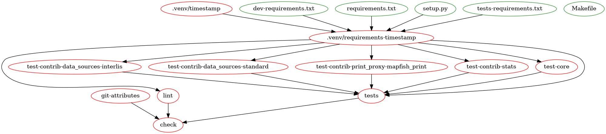
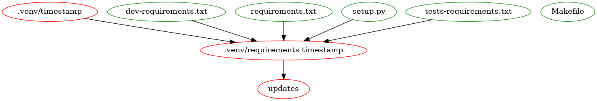
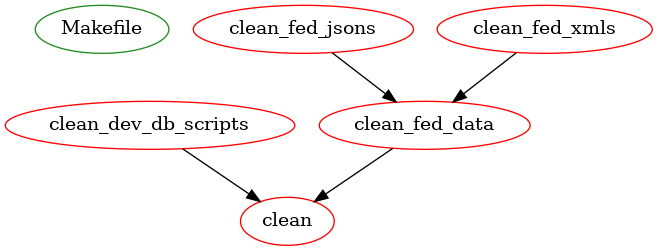
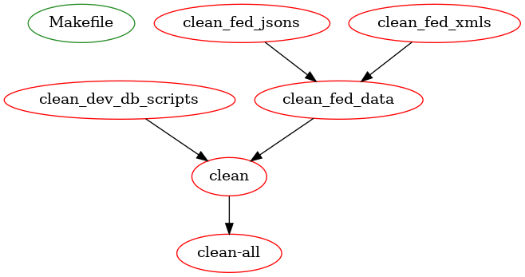

.. _makefile:

Makefile
========

``pyramid_oereb`` uses GNU-Makefile a lot to setup itself and its components. This section is a try to
describe the structure of the used
`Makefile <https://github.com/openoereb/pyramid_oereb/blob/master/Makefile>`_.

A Makefile is constructed of so called targets. Most often a target represents a file which should be
created. So you the `line <https://github.com/openoereb/pyramid_oereb/blob/master/Makefile#L267>`_ defines
the commands how to create the development.ini file which is necessary to run DEV instance of
``pyramid_oereb``.

To stay with this line in the Makefile you can see that a mako-render command is called with several variables
 from a ``virtual environment``. Thats a bit interesting. More interesting is the dependency which is defined
right on the same line of the target: ``install``

It refers to the ``install`` target
`some lines above <https://github.com/openoereb/pyramid_oereb/blob/master/Makefile#L262>`_ which has a
dependency ``requirements-timestamp`` which refers to a target
`some lines above <https://github.com/openoereb/pyramid_oereb/blob/master/Makefile#L68>`_ ... and so forth.

Important to know is that GNU Make keeps track of target files. So if some change was made for instance to
your ``requirements.txt`` file to update a pypi package a simple ``make build`` is enough to setup your project
with it and provide it in your VENV. If you call ``make build`` for another reason and say the
``requirements.txt`` file was not touched by you the complete targets which depend on this file are omitted.

This is a really powerful tool which - used correctly - can save a lot of work compared to write the same
logic in a shell scripte or in a python script. In the best case it leads to reproducible environments
independent of the machine it is issued on.

However, because it is a bit different how it works, people often struggle with its usage and avoid to use it
at all.

The following sections should help you to understand better what the
`Makefile <https://github.com/openoereb/pyramid_oereb/blob/master/Makefile>`_ provides you when you call a
decent target. It shows the dependency-target-system in a graph.

- green elements are files which are expected to be there (e.g. ``setup.py``)
- red elements are files which will be created through the target or which are meta targets ("phony" - no files are created)

General targets
---------------

``make install``
''''''''''''''''

Basically sets up your virtual environment based on the projects requirements.

``make build``
''''''''''''''

Completely sets up your application to be ready for running. This includes steps like:

- prepare ``development.ini`` file
- prepare DEV DB
- fill DEV DB
- ...

Run a development server
------------------------

``make serve-dev``
''''''''''''''''''

Runs a ``pserve`` development server which reloads when changes to python source files were made.

``make serve``
''''''''''''''

Runs a ``pserve`` development server.

Testing
-------

``make tests``
''''''''''''''

Executes all python testing. This includes the module tests (they can be executed directly to save time).

``make lint``
'''''''''''''

Does the linting to check code style conformance.

``make git-attributes``
'''''''''''''''''''''''

Executes the gitattributes checker.

``make check``
''''''''''''''

Collection target to execute all targets mentioned above in one single call.

Maintainence
------------

``make updates``
''''''''''''''''

Provides a list of outdated python packages and the possible better target version.

Documentation
-------------

``make doc-html``
'''''''''''''''''

Creates the documentation as a static HTML page with sphinx.

``make doc-latex``
''''''''''''''''''

Creates the documentation as a PDF page with sphinx.

Cleaning up
-----------

``make clean``
''''''''''''''

Wipes test results and `development.ini` file.

``make clean-all``
''''''''''''''''''

Completely wipes all setup files to provide green field for a new start.

